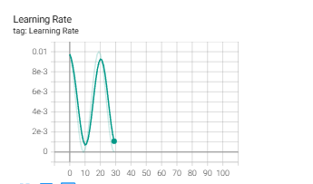

# NYCU Computer Vision 2025 Spring HW1

**StudentID**: 313553014 <br>
**Name**: 廖怡誠

## Introduction

This project focuses on image classification of various plants and animals. Some images have complex or distracting backgrounds, making it hard for the model to learn the correct features.

For example:

<table>
  <tr>
    <td align="center" width="50%">
      <br/>
      <strong>Pic 1.</strong> Complex background case.
    </td>
    <td align="center" width="50%">
      <br/>
      <strong>Pic 2.</strong> Miss target object case.
    </td>
  </tr>
</table>

To address this, I manually inspected the training images and found that the classification target is usually centered. Based on this, I cropped image borders to reduce background noise. I also applied extensive data augmentation—such as color jitter, random affine, erasing, and rotation—to improve generalization. Additionally, I tuned hyperparameters, optimizers, and learning rate schedules to further enhance performance.

## How to install

```
git clone https://github.com/yeeecheng/NYCU_Visual_Recognition2024-.git
cd NYCU_Visual_Recognition2024-/hw1
conda create -n hw1 python=3.9 -y
conda activate hw1
pip install --upgrade pip
pip install torch==2.5.1 torchvision==0.20.1 torchaudio==2.5.1 --index-url https://download.pytorch.org/whl/cu118
pip install -r requirements.txt
```
* train
```
bash ./script/train.sh
```
* test
```
bash ./script/test.sh
```


## Performence snapshot

The model's training accuracy improved steadily, with a peak around epoch 10 and further gains later on. Validation accuracy followed a similar but more fluctuating trend, showing reasonable generalization. Loss curves dropped early, rose slightly mid-training, then declined again—mirroring the learning rate schedule. The cyclical learning rate (e.g., One Cycle or cosine annealing) helped optimization, with improvements aligning well with learning rate dips. Overall, the model converged successfully with strong performance on both training and validation sets.

<div align="center">
  <br/>
  <br/>
  
</div>
