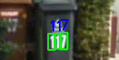
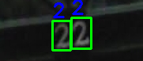

# NYCU Computer Vision 2025 Spring HW2

**StudentID**: 313553014 <br>
**Name**: 廖怡誠

## Introduction

This assignment addresses the task of digit recognition, which involves detecting and classifying digits within images. A key challenge lies in the low resolution and small size of many images, making digit detection particularly difficult and affecting evaluation metrics such as mAP. To overcome this, I employed a pre-trained Faster R-CNN model with a Vision Transformer (ViT) backbone, which offers stronger detection capabilities for small objects. Additional improvements include architectural adjustments and hyperparameter tuning to enhance performance. Further details on methodology and experimental results are provided in the following sections.

The example of images in datasets:

<table align="center">
  <tr>
    <td align="center" width="33%">
      <br/>
      <strong>Pic 1.</strong> 
    </td>
    <td align="center" width="34%">
      <br/>
      <strong>Pic 2.</strong> 
    </td>
    <td align="center" width="33%">
      <br/>
      <strong>Pic 3.</strong>
    </td>
  </tr>
</table>

## How to install

```
git clone https://github.com/yeeecheng/NYCU_Visual_Recognition2024-.git
cd NYCU_Visual_Recognition2024-/hw2
conda create -n hw2 python=3.9 -y
conda activate hw2
pip install --upgrade pip
pip install torch==2.5.1 torchvision==0.20.1 torchaudio==2.5.1 --index-url https://download.pytorch.org/whl/cu118
pip install -r requirements.txt
```
* train
```
bash ./script/train.sh
```
You can modify the augments usage: 
python main.py [-h] --data_dir DATA_DIR [--output_dir OUTPUT_DIR] [--batch_size BATCH_SIZE]
               [--epochs EPOCHS] [--lr LR] [--num_workers NUM_WORKERS] [--backend BACKEND]
* test
```
bash ./script/task1_predict.sh
```
You can modify the augments usage: 
python task1_predict.py [-h] --data_dir DATA_DIR --weight_path WEIGHT_PATH
                        [--output_json OUTPUT_JSON] [--score_thresh SCORE_THRESH]
```
bash ./script/task2_predict.sh
```
You can modify the augments usage: 
python task2_predict.py [-h] --pred_json PRED_JSON --image_dir IMAGE_DIR [--output_csv OUTPUT_CSV

## Performence snapshot

The model's training accuracy improved steadily, with a peak around epoch 10 and further gains later on. Validation accuracy followed a similar but more fluctuating trend, showing reasonable generalization. Loss curves dropped early, rose slightly mid-training, then declined again—mirroring the learning rate schedule. The cyclical learning rate (e.g., One Cycle or cosine annealing) helped optimization, with improvements aligning well with learning rate dips. Overall, the model converged successfully with strong performance on both training and validation sets.

<div align="center">
  <br/>
  <br/>
  
</div>
