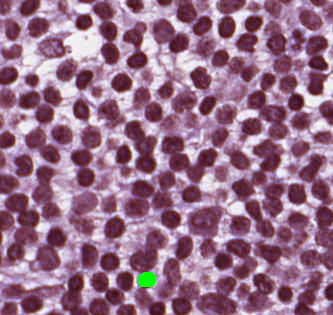
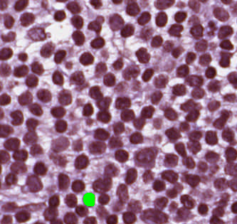
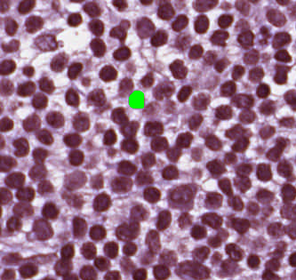

# NYCU Computer Vision 2025 Spring HW3

**StudentID**: 313553014 <br>
**Name**: 廖怡誠

## Introduction


## How to install

```
git clone https://github.com/yeeecheng/NYCU_Visual_Recognition2024-.git
cd NYCU_Visual_Recognition2024-/hw3
conda create -n hw3 python=3.9 -y
conda activate hw3
pip install --upgrade pip
pip install torch==2.5.1 torchvision==0.20.1 torchaudio==2.5.1 --index-url https://download.pytorch.org/whl/cu118
pip install -r requirements.txt
```
* train
```
bash ./script/train.sh
```
You can modify the augments usage:

python main.py [-h] --data_dir DATA_DIR [--output_dir OUTPUT_DIR] [--batch_size BATCH_SIZE]
               [--epochs EPOCHS] [--lr LR] [--num_workers NUM_WORKERS] [--backend BACKEND]
* test
```
bash ./script/task1_predict.sh
```
You can modify the augments usage:

python task1_predict.py [-h] --data_dir DATA_DIR --weight_path WEIGHT_PATH
                        [--output_json OUTPUT_JSON] [--score_thresh SCORE_THRESH]
```
bash ./script/task2_predict.sh
```
You can modify the augments usage:

python task2_predict.py [-h] --pred_json PRED_JSON --image_dir IMAGE_DIR [--output_csv OUTPUT_CSV

## Performence snapshot

Based on the ablation studies, the final configuration adopts the fasterrcnn_resnet50_fpn_v2 model with all five backbone stages set as trainable. In addition, color-based data augmentation is applied to improve generalization. This combination consistently achieved strong performance in both loss reduction and detection accuracy. While the adjustment of anchor sizes did not lead to performance gains in my current setting, I believe that with finer-grained tuning, particularly tailored to the scale distribution of digits in the dataset, it has the potential to yield further improvements.

<div align="center">
  <br/>
  <br/>
  
</div>
