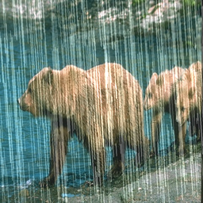
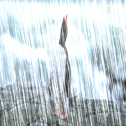
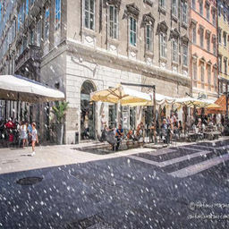
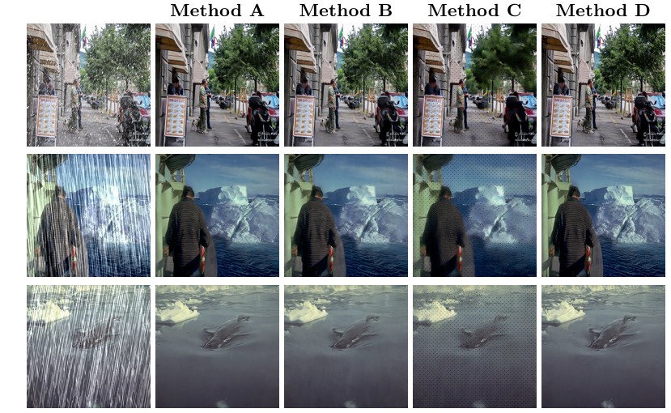

# NYCU Computer Vision 2025 Spring HW4

**StudentID**: 313553014 <br>
**Name**: 廖怡誠

## Introduction

This project addresses a blind image restoration task under two challenging degradations: rain and snow. The goal is to recover clean images without knowing the type or severity of degradation during inference. This is difficult because both types severely distort textures and edges, while the evaluation metric—PSNR—is highly sensitive to pixel-level differences.

To tackle this, I build upon the PromptIR framework, which uses learnable prompts to adapt to different degradations within a vision transformer. I propose two improvements:

1. A lightweight PromptIR architecture with fewer transformer blocks and prompt tokens to reduce overfitting and improve efficiency on low-resolution images.

2. A composite loss function combining Smooth L1 loss and SSIM loss, designed to balance pixel accuracy and perceptual quality. TV loss was tested but discarded due to oversmoothing.

I also compare our model with the state-of-the-art DA-RCOT method, which uses residual-aware optimal transport and achieves better perceptual restoration. Our experiments show that careful loss design and lightweight architecture can significantly improve PSNR and visual quality, even under severe degradations.

<table align="center">
  <tr>
    <td align="center" width="33%">
      <br/>
      <strong>Pic 1.</strong>
    </td>
    <td align="center" width="34%">
      <br/>
      <strong>Pic 2.</strong>
    </td>
    <td align="center" width="33%">
      <br/>
      <strong>Pic 3.</strong>
    </td>
  </tr>
</table>

## How to install

I used two methods, PromptIR and DA-RCOT, so I will describe them separately.


### PromptIR
```
git clone https://github.com/yeeecheng/NYCU_Visual_Recognition2024-.git
cd NYCU_Visual_Recognition2024-/hw4/PromptIR
conda env create -f env.yml
conda activate promptir

'''' if there are some issues, you should install all of them. '''
pip install warmup-scheduler
pip install einops
pip isntall wandb
pip install lightning
pip install matplotlib
pip install kornia
```

* train

```
bash ./train.sh
```

You can modify the augments usage:

python train.py [-h] [--cuda CUDA] [--epochs EPOCHS] [--batch_size BATCH_SIZE] [--lr LR] [--de_type DE_TYPE [DE_TYPE ...]]
                [--patch_size PATCH_SIZE] [--num_workers NUM_WORKERS] [--data_file_dir DATA_FILE_DIR] [--denoise_dir DENOISE_DIR]
                [--derain_dir DERAIN_DIR] [--dehaze_dir DEHAZE_DIR] [--output_path OUTPUT_PATH] [--ckpt_path CKPT_PATH]
                [--wblogger WBLOGGER] [--ckpt_dir CKPT_DIR] [--num_gpus NUM_GPUS]

* test

You can modify the augments usage:


python demo.py [-h] [--cuda CUDA] [--mode MODE] [--test_path TEST_PATH] [--output_path OUTPUT_PATH] [--ckpt_name CKPT_NAME] [--tile TILE] [--tile_size TILE_SIZE] [--tile_overlap TILE_OVERLAP]

### DA-RCOT
```
git clone https://github.com/yeeecheng/NYCU_Visual_Recognition2024-.git
cd NYCU_Visual_Recognition2024-/hw4/DA-RCOT
conda create -n DARCOT python=3.8
conda activate DARCOT
pip install torch==2.1.1 torchvision==0.16.1 torchaudio==2.1.1
pip install scikit-image
pip install einops
pip install h5py
pip install opencv-python
pip install tqdm
pip install lpips
pip install matplotlib
```
* train
```
bash ./train.sh
```

You can modify the augments usage:

python trainer.py [-h] [--batchSize BATCHSIZE] [--nEpochs NEPOCHS] [--lr LR] [--step STEP] [--cuda CUDA] [--resume RESUME] [--start-epoch START_EPOCH] [--threads THREADS] [--pretrained PRETRAINED] [--gpus GPUS] [--pairnum PAIRNUM]
                  [--de_type DE_TYPE [DE_TYPE ...]] [--denoise_dir DENOISE_DIR] [--derain_dir DERAIN_DIR] [--dehaze_dir DEHAZE_DIR] [--deblur_dir DEBLUR_DIR] [--lowlight_dir LOWLIGHT_DIR] [--desnow_dir DESNOW_DIR] [--Sigma SIGMA]
                  [--sigma SIGMA] [--optimizer OPTIMIZER] [--backbone BACKBONE] [--type TYPE] [--patch_size PATCH_SIZE] [--data_file_dir DATA_FILE_DIR] [--lambda_pixel LAMBDA_PIXEL] [--lambda_freq LAMBDA_FREQ]
                  [--lambda_contrast LAMBDA_CONTRAST]

* test

You can modify the augments usage:
python inference_our.py [-h] [--cuda] [--model MODEL] [--save SAVE] [--saveres SAVERES] [--degset DEGSET] [--gpus GPUS]

## Performence snapshot

The below figure presents a qualitative comparison of different restoration methods under challenging degradations such as rain and snow. Specifically:
- Method Arepresents the original PromptIR model trained with standard L1 loss.
- Method B corresponds to our lightweight version of PromptIR, which has a smaller architecture but is still trained using the same L1 loss.
- Method C uses the PromptIR-Lightweight model but with a modified loss function, combining Smooth L1 loss and SSIM loss to better preserve pixel accuracy and structural similarity.
- Method D shows the results from the DA-RCOT model, a recent method proposed in the literature with strong perceptual performance.

### Result

- Final score (PSNR): 30.76 in public with Method D

<div align="center">

</div>
